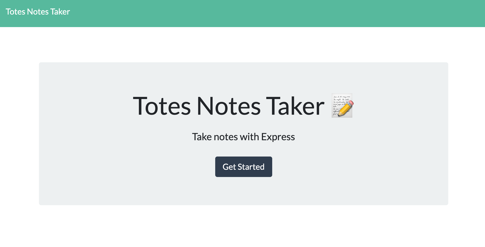
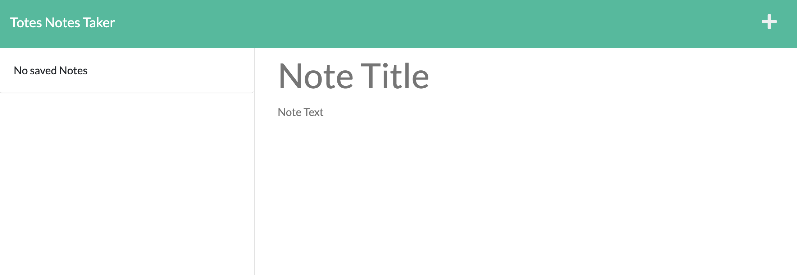
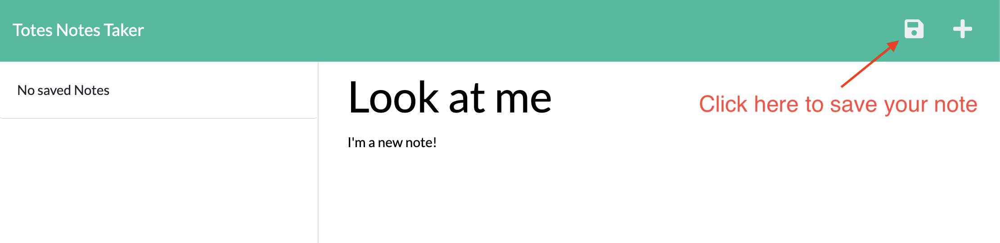
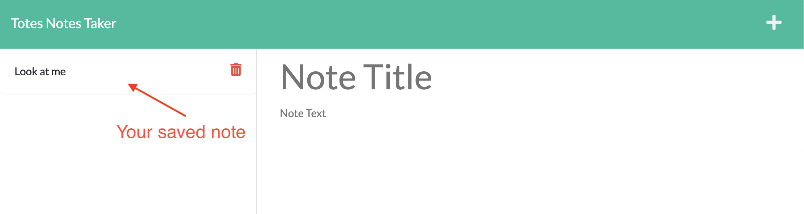

# Totes Notes Taker

## Description

Welcome to the Totes Notes Taker! This handy dandy little app will totes help you keep your notes organized and stored. I thought this would be a great app to keep track of notes, keep them organized, and be able to go back to them when I need. Although there was a some struggle with getting paths to work, this was still a very enlightening project and seems to open to doors to a variety of new uses for Express JS.

## Credits

This application uses Express.JS, Node.JS and is deployed through Heroku.

## Deployed Link

## Screenshots

Homepage

Notes page

Adding a note

Saved note
